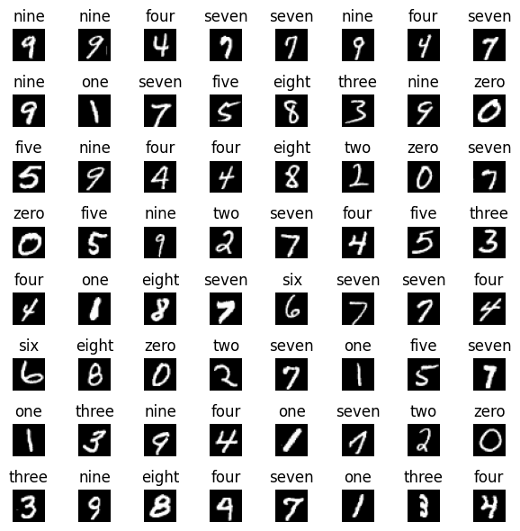
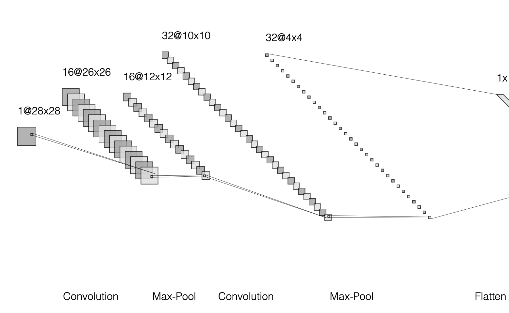
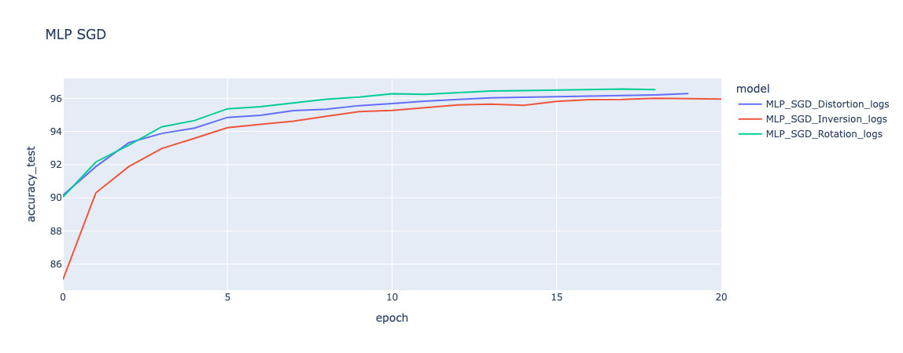

# mnist-digit-recognition

An implementation of training neural networks on the MNIST dataset for digit recognition.

---

## At a Glance

| | |
|---|---|
| **Task** | Image classification — handwritten digit recognition |
| **Dataset** | MNIST (70,000 images, 28×28 grayscale) |
| **Models** | MLP, CNN |
| **Libraries** | PyTorch, torchvision |
| **Experiment type** | Optimizer × augmentation ablation study (18 configurations) |
| **Optimizers tested** | SGD, Adam, RMSprop |
| **Augmentations tested** | Rotation, Horizontal Inversion, Elastic Distortion |
| **Best result** | Adam — mid-99% accuracy |
| **Training controls** | Early stopping (self-implemented), StepLR scheduler, fixed random seed |

---

## Abstract

This study shows an implementation of a Multi-Layer Perceptron (MLP) and a Convolutional Neural Network (CNN) on the MNIST dataset. Both models were trained using identical preprocessing procedures, including pixel scaling and dataset-specific normalization. The analysis systematically compared three optimization algorithms, Stochastic Gradient Descent (SGD), Adam, and RMSprop, and three geometric data augmentation techniques — rotation, inversion, and distortion. The experiments assessed the effects of these configurations on model stability, convergence, and generalization. Adam achieved the highest accuracy and the fastest convergence. SGD demonstrated steady and predictable learning. RMSprop was less stable and more sensitive to data augmentation. Among the augmentations, rotation had minimal effect, inversion produced near-perfect accuracy, and distortion posed the most significant challenge to convergence. Both models demonstrated robust performance and reliability under standardized and reproducible training conditions.

---

## Introduction

Digit recognition is a foundational classification task in neural networks and deep learning studies. Digit recognition tasks are frequently used to demonstrate fundamental concepts in neural network and deep learning research. The MNIST dataset serves as a standard benchmark for digit classification. It contains 70,000 grayscale images of handwritten digits, each sized 28 by 28 pixels and labeled from 0 to 9. Of these, 60,000 images are designated for training.

This report focuses on digit classification using the MNIST dataset, with the objective of maximizing test accuracy within the constraints of available computational resources and established methodologies. The dataset is accessed through the torchvision library in PyTorch and loaded using the PyTorch data loader. Training samples were collected from employees of the United States Census Bureau, and test samples were collected from high school students. This strategy poses some limitations for machine learning; however, the dataset now exhibits a wide range of handwriting styles, thereby increasing variability. This results in samples that vary in size, thickness, and alignment. It is noticeable that there are digits present that even a human would struggle to recognize.

---

## Exploration & Data Preparation

### A. Images

MNIST images are grayscale, each represented as a single-channel 28×28 pixel image. Verification of the image format confirms that all samples follow this specification. Consistent input shape and dimensions are required for model training, which necessitates validating the dataset. All images are confirmed to be of the expected size, with pixel values ranging from 0 (black) to 255 (white).

### B. Class Balances

The distribution of digit classes in both the training and test sets is relatively balanced, although certain digits, such as one, seven, and three, exhibit slight overrepresentation in one or both splits. This class imbalance should be taken into account when evaluating model performance across individual classes. The data distribution provides insight into the model's exposure to each class and may indicate whether the current split is appropriate or if repartitioning is necessary. Maintaining class balance is essential to ensure that the model learns each class with equal representation and does not develop a bias toward more frequently occurring classes. The objective is to achieve accurate predictions across all digit classes.

### C. Scaling

MNIST images contain a single channel with pixel values ranging from 0 to 255, corresponding to varying shades of gray. Scaling these values to a standard range, such as 0 to 1, or standardizing them to have zero mean and unit variance, enhances learning efficiency. Proper scaling prevents bias toward larger input values and ensures that all input features contribute equally, facilitating faster and more consistent model convergence.

### D. Approach to Normalization

Beyond scaling, image data is often normalized using the dataset's mean and standard deviation. While 0.5 is commonly used, alternative normalization strategies may be employed. This transformation supports efficient model training by maintaining activations and gradients within a stable range, thereby promoting effective model convergence.

In this implementation, normalization is based on the mean and standard deviation calculated from the training set, rather than fixed constants. This approach ensures that the transformation accurately represents the distribution of the data used for model training. Utilizing dataset-specific normalization values centers the input data around zero with unit variance, aligning preprocessing with the characteristics of the MNIST training images. The same parameters are applied to the test set to maintain consistency between training and evaluation.

---

## Model Architecture

This report utilizes two model architectures: the Multi-Layer Perceptron (MLP) and the Convolutional Neural Network (CNN). The MLP employs a feed-forward structure, where input data flows in a single direction through the network. Convolutional Neural Networks (CNNs) also utilize a feed-forward structure. However, they incorporate convolutional layers that capture spatial relationships within the input data, rather than processing each pixel independently. Both models receive identical input dimensions, as all MNIST images are 28 by 28 pixels. Flattening each image results in 784 input features for the models.

Both models utilize the Rectified Linear Unit (ReLU) as the activation function. Activation functions introduce non-linearity, enabling the models to learn complex decision boundaries. Without non-linear activation, stacked linear layers would be functionally equivalent to a single linear transformation. The output layer does not apply a softmax function, as the BCEWithLogitsLoss loss function is used. This function expects raw logits as input and internally applies the sigmoid activation and binary cross-entropy calculation. The sigmoid function maps logits to probabilities between 0 and 1, while binary cross-entropy quantifies the difference between predicted probabilities and ground truth labels.

- **ReLU:** f(x) = max(0, x)
- **BCEWithLogitsLoss:** L(y, ŷ) = −Σ [yᵢ log(σ(ŷ)) + (1−yᵢ) log(1−σ(ŷ))]  where σ(ŷ) is the sigmoid function used to convert logits to probabilities.

### A. The Fully-Connected Multi-Layer Perceptron (MLP)

The model reduces dimensionality from the initial 784-element input vector through a sequence of fully connected (dense) linear layers. The output layer produces ten neurons, each corresponding to one of the target digit classes.

| Layer | Type | Input | Output |
|-------|------|-------|--------|
| Input | Linear | 784 | 128 |
| — | ReLU | — | — |
| Hidden | Linear | 128 | 64 |
| — | ReLU | — | — |
| Output | Linear | 64 | 10 (raw logits) |

### B. The Convolutional Neural Network (CNN)

The CNN architecture comprises two convolutional blocks, each followed by a max-pooling layer that reduces spatial dimensions while preserving key features. The first convolutional layer extracts 16 feature maps using a 3×3 kernel, and the second layer increases this to 32 feature maps. Following the final pooling operation, the resulting feature maps (32×4×4) are flattened into a 512-element vector, which is then processed by a fully connected feed-forward network.

| Layer | In Ch | In Size | (k,s,p,d) | Out Ch | Out Size |
|-------|-------|---------|-----------|--------|----------|
| Conv 1 | 1 | 28×28 | 3,1,0,1 | 16 | 26×26 |
| Pool 1 | 16 | 26×26 | 3,2,0,1 | 16 | 12×12 |
| Conv 2 | 16 | 12×12 | 3,1,0,1 | 32 | 10×10 |
| Pool 2 | 32 | 10×10 | 3,2,0,1 | 32 | 4×4 |

The feed-forward network that processes the 512 input features from the CNN shares a similar structure with the previously described MLP, differing primarily in the number of features between the initial layers.

| Layer | Type | Input | Output |
|-------|------|-------|--------|
| Input | Linear | 512 | 256 |
| — | ReLU | — | — |
| Hidden | Linear | 256 | 128 |
| — | ReLU | — | — |
| Output | Linear | 128 | 10 (raw logits) |

The model produces raw logits as output, consistent with the requirements of the selected loss function.

---

## Experiments

### A. Introduction

Following the introduction of both model architectures, a series of experiments was conducted to evaluate the impact of various optimization and augmentation strategies on the performance of MNIST classification. The primary objective was to assess the models' generalization capabilities under different training conditions. Three optimizers and three augmentation techniques were tested, resulting in nine unique combinations for each model.

Before discussing these methods, the importance of reproducibility must be emphasized. To ensure credible results, all random operations in the experimental pipeline, including model weight initialization, data shuffling, augmentation transformations, and parallel data loading, were controlled using a fixed random seed. Reproducibility is essential in machine learning to attribute performance differences to model configurations rather than random variation.

### B. Optimizers

Optimization algorithms update model weights during the backward pass of training by minimizing the loss function. The choice of optimizer influences the efficiency and effectiveness of model convergence. Different optimizers employ distinct update strategies and hyperparameters, which may confer advantages depending on the specific task. The optimizers compared in this report are:

- Stochastic Gradient Descent (SGD)
- Adaptive Moment Estimation (Adam)
- RMSprop

### C. Augmentations

Data augmentation refers to techniques that generate additional training samples by applying transformations to existing data. These modifications, which may be minor or substantial, enhance the model's ability to generalize to unseen data and help mitigate overfitting. In this study, all augmentations are geometric transformations, which alter the spatial orientation of images without changing their intensity distribution.

The three geometric augmentations tested are:

- **Rotation:** Randomly rotates images within a defined angle range, applied with a specified probability.
- **Horizontal Inversion:** Flips images horizontally with a defined probability.
- **Elastic Distortion:** Applies smooth, non-linear distortions to images.

### Experiment Table

| # | Model | Optimizer | Augmentation |
|---|-------|-----------|--------------|
| 1 | MLP | SGD | Rotation |
| 2 | MLP | SGD | Distortion |
| 3 | MLP | SGD | Inversion |
| 4 | MLP | Adam | Rotation |
| 5 | MLP | Adam | Distortion |
| 6 | MLP | Adam | Inversion |
| 7 | MLP | RMSprop | Rotation |
| 8 | MLP | RMSprop | Distortion |
| 9 | MLP | RMSprop | Inversion |
| 10 | CNN | SGD | Rotation |
| 11 | CNN | SGD | Distortion |
| 12 | CNN | SGD | Inversion |
| 13 | CNN | Adam | Rotation |
| 14 | CNN | Adam | Distortion |
| 15 | CNN | Adam | Inversion |
| 16 | CNN | RMSprop | Rotation |
| 17 | CNN | RMSprop | Distortion |
| 18 | CNN | RMSprop | Inversion |

### D. Early Stopper & Learning Rate Scheduler

The last things implemented in the training loop were an early stopper and a learning rate scheduler. The early stopper is one of the tools employed in machine learning to fight overfitting or underfitting, depending on the scenario. Overfitting is a common problem in deep learning and is a byproduct of the model memorizing the training data, leading to poor generalization on new, unseen data. The early stopper monitors the progress of both training and validation runs within a set of improvement thresholds, to which it can stop the process if the expected convergence is not achieved.

Because model training can change a lot over time, using a fixed learning rate is usually not the best choice. Adjusting the learning rate as training goes on helps the model find better solutions quicker.

**Early Stopper** (self-implemented, monitors train & test loss):
- Patience: 12 epochs
- Improvement threshold: 5e-2

**Learning Rate Scheduler** (PyTorch StepLR):
- Step size: 5
- Gamma: 99e-2
- Start LR: 1e-3

---

## Training and Evaluation

Once all parameters are configured, training of the nine distinct model configurations on both the MLP and CNN architectures can commence. Each configuration commences training with identical parameters, and the maximum permissible number of epochs is set to 100. During each iteration, a forward pass is executed, during which the input data is propagated through the network to generate predictions. Subsequently, a backward pass is performed, using the discrepancy between predictions and actual targets to update the model's parameters. This process repeats over many epochs, letting the model gradually lower the loss and improve accuracy.

Experiments showed that a learning rate of about 0.001 works well, and the step size should not be too small or too large. If these settings are off, the model might not find the best solution and early stopping could kick in too soon. Once a good starting point is found, it is important to watch certain parameters to understand how the model is learning.

**Trackable parameters:** Epoch · Training accuracy · Training loss · Learning rate · Testing loss · Testing accuracy

---

## Results and Discussion

### A. Optimizers

**SGD** — SGD was the most stable and predictable optimizer. It started off with the lowest performance but improved steadily with each epoch. This pattern was the same for all three augmentations tested: rotation, inversion, and distortion. Models trained with SGD showed very consistent learning, and their accuracy peaked at 96% before early stopping. Distortion had a bit more impact, but still not much. The models quickly got used to the changed shapes, with only small changes before settling down. This shows the models could still generalize even when the images were warped.

**Adam** — Adam made quick progress at the start, converging well and beating the other optimizers for all types of augmentation. However, it was not always stable, showing some ups and downs early on before settling down later. Adam had the best results, reaching the mid-99% accuracy range.

**RMSprop** — RMSprop was the most unstable of the three optimizers. Early on, it had big jumps and drops in performance, with lots of ups and downs before it finally settled later. It triggered early stopping more often than the others. While its results were still good, they were not as strong as Adam or SGD.

In these tests on MNIST, SGD was the most stable, improving steadily over time. Adam was the most efficient and had the best performance, balancing adaptability and stability. RMSprop was the most unpredictable. Both Adam and RMSprop started out more experimental but became more stable as training went on, while SGD stayed consistent throughout.

### B. Augmentations

The augmentations — rotation, distortion, and inversion — had some effect on how stable the models learned. The CNN's learning speed and ability to generalize were mostly unaffected by some of these changes. In one case, a setup failed completely, likely due to a small coding mistake. Overall, the accuracy stayed steady across epochs, so the impact of augmentation was not clear at this scale.

**Rotation** — Rotation augmentation worked well for both models. It is not clear if the high results were because of the range of rotation angles, since some ranges gave results similar to having no augmentation. The highest accuracy was actually reached without any augmentation.

**Distortion** — Distortion was the hardest of the three augmentations. The models started with lower accuracy, but improved over time. Training was more challenging, showing that generalization was tougher. This augmentation made the models work harder to learn the data patterns.

**Inversion** — Inversion augmentation led to an unusual result. Models trained with inversion reached almost perfect accuracy early on and stayed above 99% throughout. This suggests that inverting pixels did not hurt the model's ability to generalize. However, some runs failed to train because early stopping was triggered, likely due to a coding error.

---

## Conclusion

The results indicate that Adam consistently reached the highest accuracy and converged the fastest in all tested setups. SGD was the most stable and showed a predictable learning pattern. In contrast, RMSprop's performance was less stable and more affected by the data augmentations. Of the augmentations, rotation had little negative effect, inversion worked well with only minor added difficulty, and distortion was the hardest for the models, given the chosen parameters. When rotation was applied with greater movement and frequency, it had a much stronger negative impact. Overall, the experiment shows that both networks can perform well on the MNIST dataset.

---

## References

1. GeeksforGeeks, "How to normalize images in PyTorch?," 2021. https://www.geeksforgeeks.org/python/how-to-normalize-images-in-pytorch/. [Accessed: Oct. 23, 2025].
2. Arxiv.org, "The harms of class imbalance corrections for machine learning based prediction models: a simulation study," 2022. https://arxiv.org/html/2404.19494v1. [Accessed: Oct. 23, 2025].
3. J. Brownlee, "How to manually scale image pixel data for deep learning," 2019. https://machinelearningmastery.com/how-to-manually-scale-image-pixel-data-for-deep-learning/.
4. PyTorch.org, "BCEWithLogitsLoss PyTorch 2.7 documentation," 2024. https://docs.pytorch.org/docs/stable/generated/torch.nn.BCEWithLogitsLoss.html.
5. PyTorch.org, "torch.utils.data PyTorch 2.7 documentation," 2024. https://docs.pytorch.org/docs/stable/data.html.
6. R. Sonthalia, J. Lok, and E. Rebrova, "On regularization via early stopping for least squares regression," 2024. https://arxiv.org/abs/2406.04425. [Accessed: Oct. 23, 2025].
7. Wikipedia Contributors, "MNIST database," 2019. https://en.wikipedia.org/wiki/MNISTdatabase.

